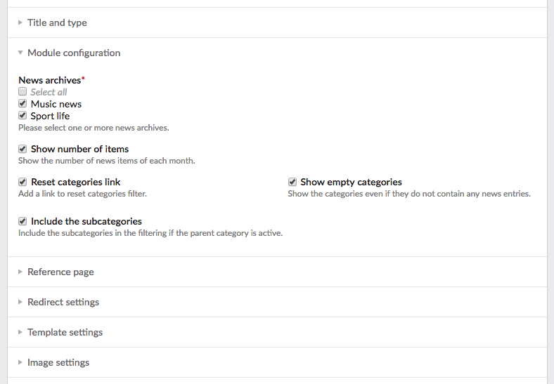

# Frontend modules – News Categories bundle

1. [Installation](installation.md)
2. [Configuration](configuration.md)
3. [**Frontend modules**](frontend-modules.md)
4. [Template adjustments](template-adjustments.md)
5. [News feeds](news-feeds.md)
6. [Multilingual features](multilingual-features.md)
7. [Insert tags](insert-tags.md)

## Frontend modules

### News categories list

The extension comes with one extra front end module. It will generate a list of categories as links that allows users to 
filter news items in other news front end modules.

### News modules

The bundle overwrites the default news modules by adding the extra category related features to them. They are fully
optional so your existing modules setup won't be affected until you change their configuration manually.

> **Important:** Make sure to check the `Filter by categories` option in the news front end module settings 
> or the filtering won't work!

Currently the following news modules are supported:

 - News archive
 - News archive menu
 - News list
 - News reader
 
### Related categories list

The news list module has also a feature to display the related news items based on the categories of the current item. 
This is typically needed when you have a news reader module on the page and below you would like to display similar 
news. To achieve this, the module structure on the page has to be the following:

 - news reader module
 - news list module (in related categories mode)

## Filter content element

If you are managing a lot of categories and would like to display the different categories on different pages, 
you can have only one news list module and insert it using content element called `News module filtered`. The element 
allows you to override the module configuration with your custom one, so there is no longer need to create multiple 
list modules.
